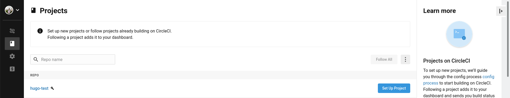
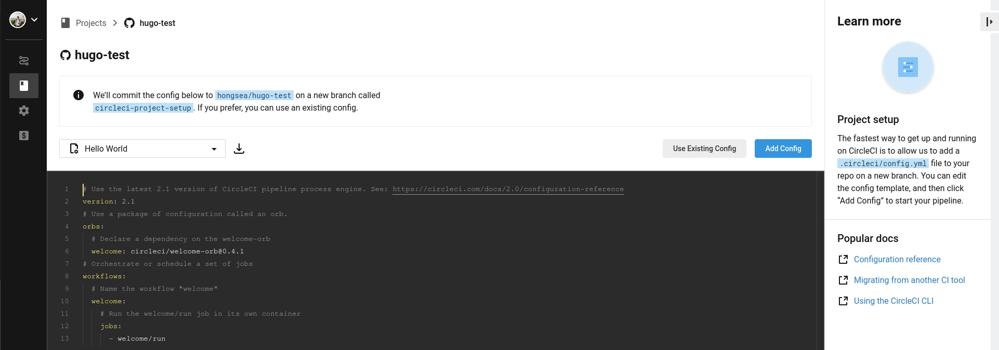
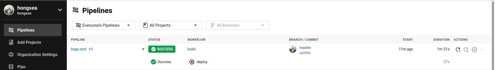
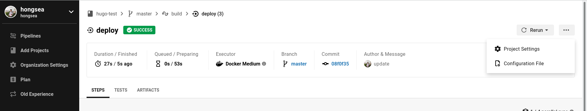
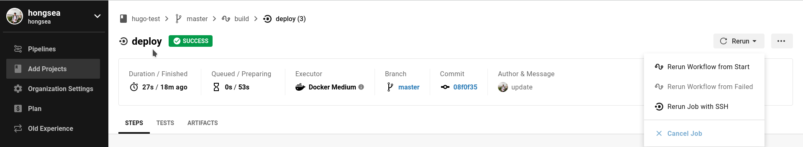

```
DEV     : 005
Title   : How to deploy hugo with circleCI
Author  : Heng Hongsea
Check by: Saing Sab
Status  : Pending verify
Create  : 2020-07-31
Update  : 2020-07-31
Version : 0.1
```

# **How to deploy hugo with CircleCI**

### Automated testing
* CircleCI automatically runs your pipeline in a clean container or virtual machine, allowing you to test every commit.

### Automated deployment
* Passing pipelines are deployed to various environments so your product goes to market faster.

## Sign Up and Try CircleCI
To run your very first build on CircleCI, complete the following steps:

1.  Go to the [Sign Up](https://circleci.com/signup/) page.
    
2.  Click on either **Sign Up with GitHub** or **Sign Up with Bitbucket** to start the authentication process and allow CircleCI to access your code. 
**Note:** if you are using GitHub you have the option to limit CircleCI, preventing access to your private repositories. To do this, use the drop down menu at the side of the Sign Up button, and select Public Repos Only from the list.
    
3.  Type your GitHub or Bitbucket username, password, and two-factor authorization if applicable, then click Sign In/Login.
    
4.  Click the Authorize Application or equivalent button. The CircleCI Pipelines Dashboard appears.
    
5. Config circleci on your project.
	* Create config file on .circleci/config.yml.
	```
	version: 2
	jobs:
	  deploy:
	    docker:
	      - image: pionux/build-deploy:0.1
	    steps:
	      - run:
	          name: "Deploy hugo"
	          command: |
	            git clone https://github.com/username/project.git
	            cd project && hugo -D
	            cd .. && touch hugo
	            echo $hugo > hugo
	            chmod +x hugo && ./hugo
	workflows:
	   version: 2
	   build:
	     jobs:
	       - deploy
	```
	*  Configuring CircleCI
		- jobs:  A run is comprised of one or more named jobs. Jobs are specified in the `jobs` map, see [Sample 2.0 config.yml](https://circleci.com/docs/2.0/sample-config/) for two examples of a `job` map. The name of the job is the key in the map, and the value is a map describing the job.
		- deploy: is [job name](https://circleci.com/docs/2.0/configuration-reference/#job_name)
		- we use docker image for build project.
		- Title of the step to be shown in the CircleCI UI.
		- Command to run via the shell (we will build hugo site and deploy to server.).
		- workflows: Used for orchestrating all jobs. Each workflow consists of the workflow name as a key and a map as a value. A name should be unique within the current `config.yml`. The top-level keys for the Workflows configuration are `version` and `jobs`.
6.  Use the Add Project page of the CircleCI app to start building your project code.

7. You need add file .circleci/config.yml to project.
8. Once on the Project page, find the project you are using, and click **Use Existing Config**

9. Add SSH Keys and Environment Variables for deploy to server.
	Click on Pipelines -> deploy -> Project Settings
	
	
	* Add SSH Keys
		- Click on `Add SSH key` for add private key.
	* Add Environment Variables
		- Click on `Variable` for add nvironment variables
10. And then return to Pipelines
	Click on `Pipelines -> deploy -> Return Workflow from Start` for redeploy.
	


