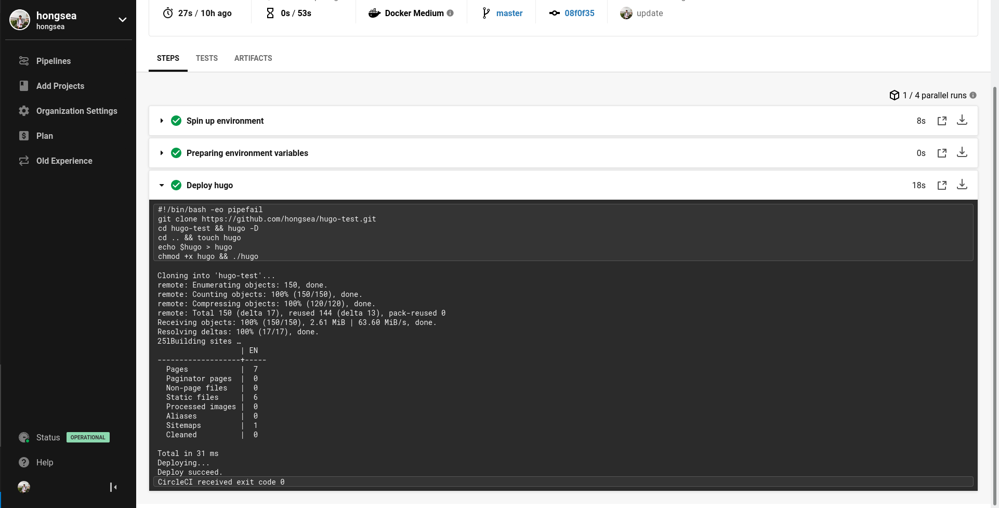

```
DEV       : 005
Title     : How to deploy hugo with circleCI
Author    : Heng Hongsea
checked by: Saing Sab
Status    : Pending verify
Create    : 2020-07-31
Update    : 2020-08-01
Version   : 0.1
```

# **How to deploy hugo with CircleCI**

### Intro
CircleCI is a modern continuous integration and continuous delivery (CI/CD) platform. The CircleCI Enterprise solution is installable inside your private cloud or data center and is free to try for a limited time. CircleCI automates build, test, and deployment of software. CircleCI integrates with a VCS and automatically runs a series of steps every time that it detects a change to your repository. Here’s an explanation of what CI and CD are and how CircleCI fits into the process.

**Continuous Integration:** Basically, Continuous Integration means multiple developers pushing small, frequent changes to a shared repository or ‘master’. They are integrating changes continuously, rather than periodically, and thus–ta da!–Continuous Integration. There’s a lot out there on [CI best practices](https://en.wikipedia.org/wiki/Continuous_integration#Best_practices) you can adhere to, but I’d say one of the most important is test all changes that you are making to your code base.

**Continuous Integration:** If your tests pass, then you can deploy your code to development, staging, production, etc., automatically. The specific way that you do this depends on what type of infrastructure you are deploying to.

### Scenario
We have a project website hugo www.hugotest.com push on github and want to auto build and auto deploy to server.  Now we will use CircleCI for do this.

### Solution
## Sign Up and Try CircleCI
To run your very first build on CircleCI, complete the following steps:

1.  Go to the [Sign Up](https://circleci.com/signup/) page.
    
2.  Click on either **Sign Up with GitHub** or **Sign Up with Bitbucket** to start the authentication process and allow CircleCI to access your code. 
**Note:** if you are using GitHub you have the option to limit CircleCI, preventing access to your private repositories. To do this, use the drop down menu at the side of the Sign Up button, and select Public Repos Only from the list.
    
3.  Type your GitHub or Bitbucket username, password, and two-factor authorization if applicable, then click Sign In/Login.
    
4.  Click the Authorize Application or equivalent button. The CircleCI Pipelines Dashboard appears.
    
5. Config circleci on your project.
	* Create config file on .circleci/config.yml.
	```
	version: 2
	jobs:
	  deploy:
	    docker:
	      - image: pionux/build-deploy:0.1
	    steps:
	      - run:
	          name: "Deploy hugo"
	          command: |
	            git clone https://github.com/username/project.git
	            cd project && hugo -D
	            cd .. && touch hugo
	            echo $hugo > hugo
	            chmod +x hugo && ./hugo
	workflows:
	   version: 2
	   build:
	     jobs:
	       - deploy
	```
	*  Configuring CircleCI
		- jobs:  A run is comprised of one or more named jobs. Jobs are specified in the `jobs` map, see [Sample 2.0 config.yml](https://circleci.com/docs/2.0/sample-config/) for two examples of a `job` map. The name of the job is the key in the map, and the value is a map describing the job.
		- deploy: is [job name](https://circleci.com/docs/2.0/configuration-reference/#job_name)
		- we use docker image for build project.
		- Title of the step to be shown in the CircleCI UI.
		- Command to run via the shell (First we will clone project on github and build with `hugo -D` base on site. We will create environment variables for deploy to server via rsync, it mean that after build hugo already we will rsync this project to server).
		- workflows: Used for orchestrating all jobs. Each workflow consists of the workflow name as a key and a map as a value. A name should be unique within the current `config.yml`. The top-level keys for the Workflows configuration are `version` and `jobs`.
6. You need add file .circleci/config.yml to project before Set Up Project.
7. After you Sign Up with GitHub already you need use the Add Project page of the CircleCI app to start building your project code.

8. Once on the Project page, find the project you are using, and click **Use Existing Config** and then **Start Building**.

9. Add SSH Keys and Environment Variables for deploy to server.
	Click on Pipelines -> deploy -> Project Settings.
	
	
	* Add SSH Keys
		- Click on `Add SSH key` for add private key server.
	* Add Environment Variables
		- Click on `Variable` for add evironment variables (for rsync this website to server.
10. And then return to Pipelines
	Click on `Pipelines -> deploy -> Return Workflow from Start` for redeploy.
	
	


11. Configure nginx reverse proxy on server. [more detail](https://github.com/koompi/sdc-archive/blob/master/dev/nginx_reverse_proxy004.md)

	
	Create config file to /etc/nginx/sites-avaiable/www.hugotest.com.conf

	```
	
	#Add this config to www.hugotest.com.conf
	server {
       listen 80;
       listen [::]:80;

       server_name www.hugotest.com;
       root /path/project/hugotest.com/public/;
       index index.html index.xml; # Hugo generates HTML
 
       location / {
               proxy_set_header Upgrade $http_upgrade;
               proxy_set_header Connection 'upgrade';
               proxy_set_header Host $host;
               proxy_cache_bypass $http_upgrade;
	       }
	}
	```

	Like froom sites-avaiable to sites-enabled, and then restart service nginx.

	```
	$ sudo ln -s /etc/nginx/sites-avaiable/www.hugotest.com.conf /etc/nginx/sites-enabled/www.hugotest.com.conf
	$ sudo nginx -t
	$ sudo systemctl restart nginx
	```