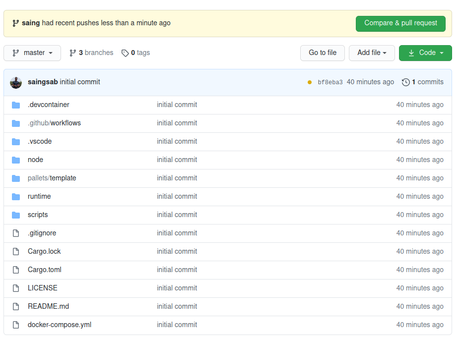
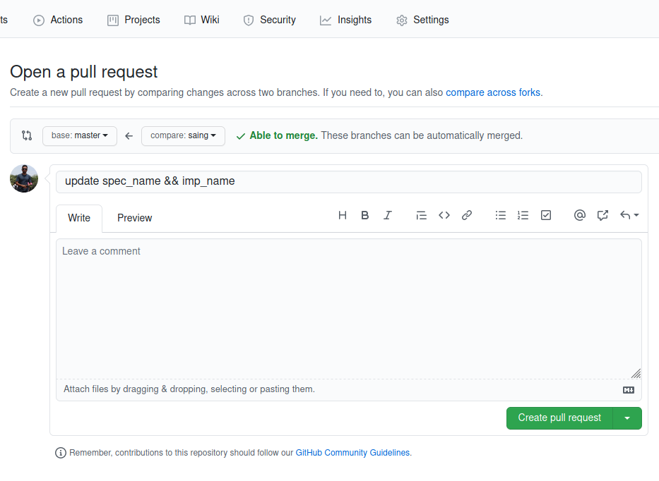
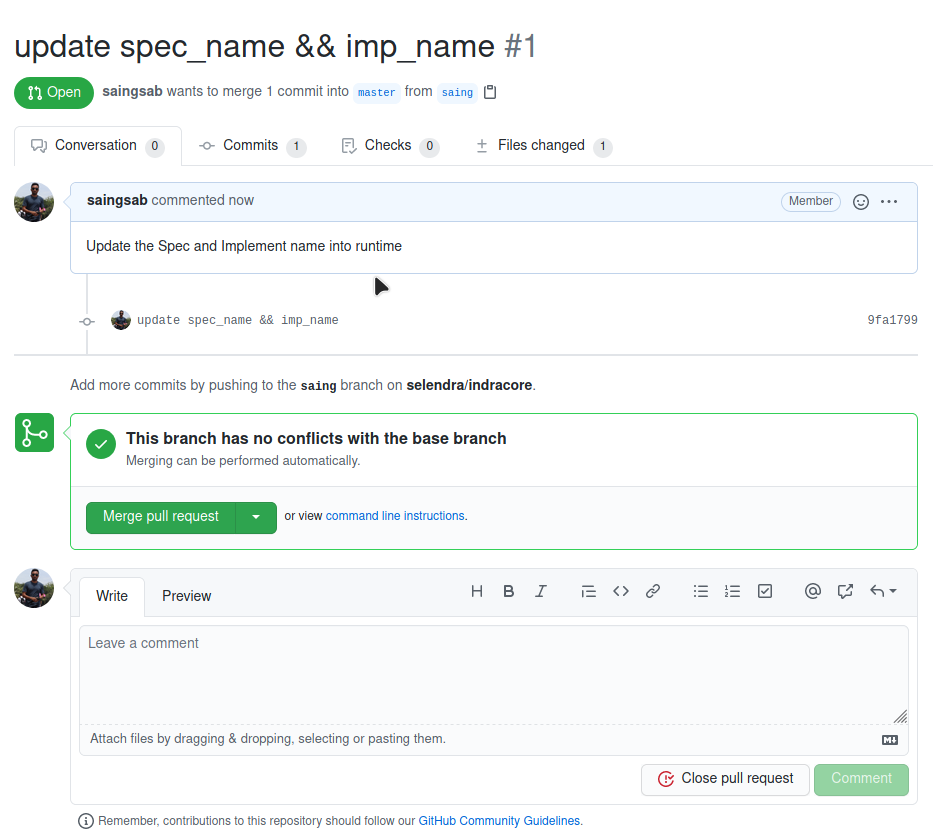
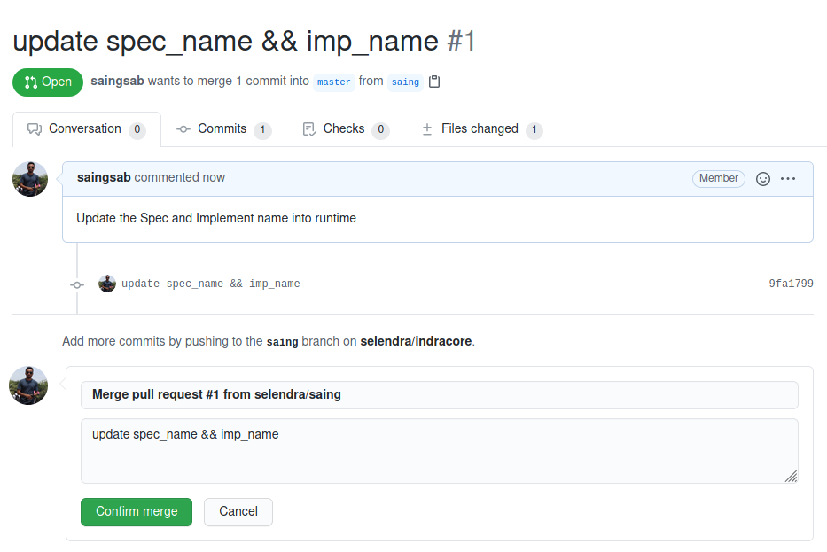

```
SA      : 006
Title   : How to merge a contributing code
Author  : Saing Sab
Status  : Active
Create  : 2020-08-14
Update  : 2020-08-14
Version : 1
```
## How to merge a contributing code
#### Intro
Working on open source is needed to open for contributions from other developers so that the software is much more strong and secure.

#### Scenario
To keep track of all the contributors and make the master branch easy, the latest and reliable source code needs to have a proper way to merge.

#### Solution
1. Push to sub branches 
```
git checkout -b <prefer branches name ex. saing>
```

2.Notify admin 
Github will notify branches admin automatically and will till keep under the pull requests tab.


3. Create pull requests
You can leave the message and create the pull request with that green button.


4. Admin review the code 


5. Confirm Merge 
If the code is good to go with master then admin will confirm merge.


6. Verify 
If the code successfully merges it will occur the message congratulation as below.


If there is something wrong or the update with fonfig the code the error should occur and you will be notified.