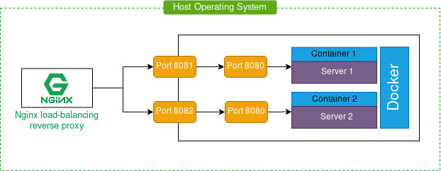

```
DEV: 007
Title: How to config nginx load-balancing reverse proxy with docker
Author: Heng Hongsea
Status: Active
Create: 2020-09-01
Update: 2020-09-01
version: 0.1.0
```

# How to config nginx load-balancing reverse proxy with docker

## About Load Balancing

The load balancing the process of distributing traffic to multiple instances of an application. It is commonly used for better resource utilition, maximizing throughput and reducing latency apart from ensuring fault-tolerance of deployed applications.

## NGINX Load Balancing reverse proxy




NGINX is a modern, open-source and high-performance web server. Apart from serving static and dynamic content very efficently, NGINX can also be configured to act a load balancer that can handle a large number of incoming connections and distribute them to separate upstream servers for processing thereby achieving fault tolerance and better performance of deployed application.

### Intro

we want to have a running backup (server2), so If we need to restart, update, or (server1) is down, we need server 2 to be live on your domain.

### Scenario

To increased application availability through redundancy, increased reliability and scalability (more servers can be added in the mix when traffic increases).


### Configure NGINX Load Balancing reverse proxy

1. Install 

Reference
https://www.journaldev.com/27299/how-to-configure-nginx-load-balancing