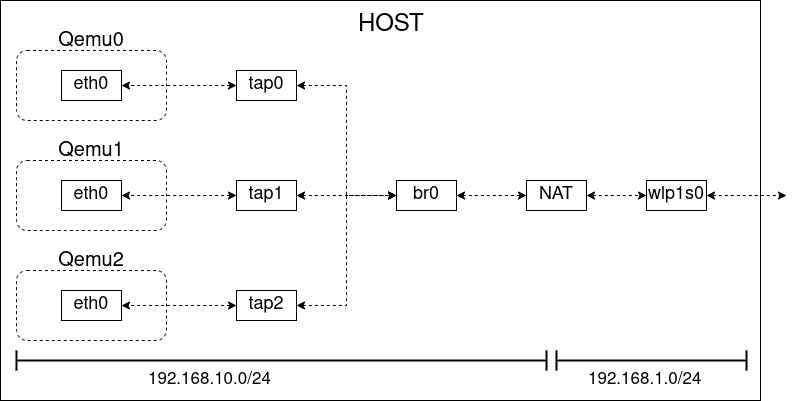
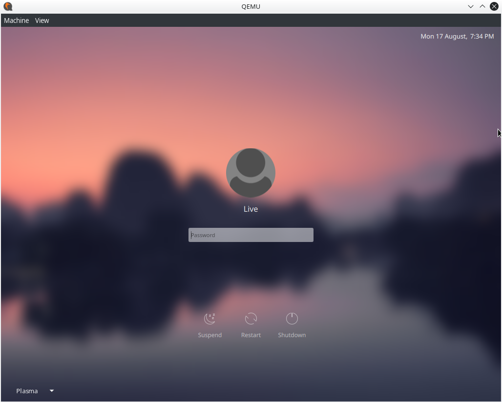

```
SA: 005
Title: How to run Qemu on KOOMPI OS with tap interface
Author: Heng Hongsea
Status: Active
Create: 2020-08-17
Update: 2020-08-17
Version: 0.1
```

# How to run Qemu on KOOMPI OS with tap interface

[QEMU](https://www.qemu.org/) is a virtualization technology emulator that allows you to run operating systems and Linux distributions easily on your current system without the need to install them or burn their ISO files. It is like VMware or VirtualBox. You can use it at anytime to emulate running any operating system you want on a lot of devices and architecture.


### Diagram



## Install Qemu

```
$ sudo pacman -S qemu
```

## How to use Qemu

QEMU provides a lot of options, architectures and formats to use. And we’ll see many different examples in order to understand the possible ways to achieve our goals using QEMU.

First, we have to create a virtual hard drive image if we want to install our virtual operating system somewhere. This image file will contain all the data and files of the operating system after installation. To do this, we can use the “qemu-img” tool.

### **1. Create image**

To create an image file with the size of 10GB and qcow2 format (default format for QEMU images), run:

```
$ qemu-img create -f qcow2 Qemu0.img 20G
$ qemu-img create -f qcow2 Qemu1.img 20G
$ qemu-img create -f qcow2 Qemu2.img 20G
```

***Note that a new file called “Qemu.img” is now created at your home folder (or the place where you run the terminal).***

### **2. Boot from ISO file**

Now that we’ve created our image file, if we have an ISO file for a Linux distribution or any other operating system and we want to test it using QEMU and use the new image file we created as a hard drive, we can run:

I. For Qemu0

```
$ sudo qemu-system-x86_64 -m 1024 -device qemu-xhci -boot d -enable-kvm -smp 2 -net nic -net user -hda Qemu0.img -cdrom /path/file.iso
```

II. For Qemu1

```
$ sudo qemu-system-x86_64 -m 1024 -device qemu-xhci -boot d -enable-kvm -smp 2 -net nic -net user -hda Qemu1.img -cdrom /path/file.iso
```

III. For Qemu2

```
$ sudo qemu-system-x86_64 -m 1024 -device qemu-xhci -boot d -enable-kvm -smp 2 -net nic -net user -hda Qemu2.img -cdrom /path/file.iso
```

* `-m 1024`: Here we chose the RAM amount that we want to provide for QEMU when running the ISO file. We chose 1024MB here. You should change this number according to your computer's RAM.

* `-boot -d`: The boot option allows us to specify the boot order, which device should be booted first? -d means that the CD-ROM will be the first, then QEMU will boot normally to the hard drive image. We have used the -cdrom option as you can see at the end of the command.

* `-enable-kvm`: This is a very important option. It allows us to use the KVM technology to emulate the architecture we want. Without it, QEMU will use software rendering which is very slow. That’s why we must use this option, just make sure that the virtualization options are enabled from your computer BIOS.

* `-smp 3`: If we want to use more than 1 core for the emulated operating system, we can use this option. We chose to use 3 cores to run the virtual image which will make it faster. You should change this number according to your computer’s CPU.

* `-net nic -net user`: By using these options, we will enable an Ethernet Internet connection to be available in the running virtual machine by default.

* `-hda Qemu0.img`: Here we specified the path for the hard drive which will be used. In our case, it was the testing-image.img file which we created before.

* `-cdrom /path/file.iso`: Finally we told QEMU that we want to boot our ISO file “/path/file.iso”.

After you run the previous command, QEMU will start for you as a standalone window:



### 3. Start Qemu after install

Now, if you want to just boot from the image file without the ISO file (for example if you have finished installing and now you always want to boot the installed system), you can just remove the -cdrom option:

```
sudo qemu-system-x86_64 -m 1024 -boot d -enable-kvm -smp 3 -net nic -net user -hda Qemu0.img
```

## Bridge Interface

1. Create network bridge

    Creating a network bridge seems necessary, even if only 1 guest is configured. Create the bridge and add each TAP to it. Spanning tree protocol (stp) is disabled because there is only 1 bridge.

    ```
    $ sudo ip link add br0 type bridge
    $ sudo ip link set br0 up
    $ sudo ip addr add 192.168.10.1/24 dev br0
    ```

2. Create tap interface and add to bridge interface

    This allows the guest to communicate with the bridge. QEMU's default group is kvm, ensure that the correct group is given permissions to control the TAP. Enabling promiscuous mode (promisc) for the adapter might be unnecessary. And then add all tap interface to br0 bridge interface.

    I. For Qemu0

    ```
    $ sudo ip tuntap add dev tap0 mode tap group kvm 
    $ sudo ip link set dev tap0 up promisc on 
    $ sudo ip link set tap0 master br0 
    ```

    II. For Qemu1
    
    ```
    $ sudo ip tuntap add dev tap1 mode tap group kvm 
    $ sudo ip link set dev tap1 up promisc on 
    $ sudo ip link set tap1 master br0 
    ```

    I. For Qemu2
    
    ```
    $ sudo ip tuntap add dev tap2 mode tap group kvm 
    $ sudo ip link set dev tap2 up promisc on 
    $ sudo ip link set tap2 master br0 
    ```

## Configure Static IP and Set Metric

1. Install dhcpcd

    ```
    $ sudo pacman -S dhcpcd
    ```

2. Configure dhcpcd

    Configure a static profile for dhcpcd in `/etc/dhcpcd.conf`. You can change Network Address according to your environment. Interface wlp1s0 is wan interface for route to internet and br0 is lan interface.So you add metric wlp1s0 bigger then br0 to make wlp1s0 route to internet.


    ```
    interface br0
    metric 300
    static ip_address=192.168.10.1/24
    static routers=192.168.10.1

    interface wlp1s0
    metric 200
    ```

3. Restart service

    ```
    $ sudo systemctl enable dhcpcd.service
    $ sudo systemctl restart dhcpcd.service
    ```

## Configure DHCP Server

1. Install dhcp server

    ```
    $ sudo pacman -S dhcp
    ```

2. Configure dhcp server

    The default dhcpd.conf contains many uncommented examples, so relocate it: 
    
    ```
    $ sudo cp /etc/dhcpd.conf /etc/dhcpd.conf.example
    $ echo "" > /etc/dhcpd.conf
    ```

    The minimal configuration file `/etc/dhcpd.conf` may look like: 

    ```
    subnet 192.168.10.0 netmask 255.255.255.0 {
    authoritative; 
    default-lease-time 3600; 
    max-lease-time 3600;  
    option routers                192.168.10.1;
    option subnet-mask            255.255.255.0;
    range dynamic-bootp           192.168.10.10 192.168.10.200;
    option domain-name            "your-domain";
    option domain-name-servers    8.8.8.8, 8.8.4.4;
    }

    host Qemu0{
    hardware ethernet 52:54:00:12:34:56;
    fixed-address 192.168.10.10;
    }
    host Qemu1{
    hardware ethernet 00:00:00:11:11:11;
    fixed-address 192.168.10.11;
    }

    host Qemu2{
    hardware ethernet 00:00:00:22:22:22;
    fixed-address 192.168.10.12;
    }
    ```

3. Restart Service

    ```
    $ sudo systemctl enable dhcpd4.service
    $ sudo systemctl restart dhcpd4.service
    ```


## Packet forwarding and NAT

Allows for proper packet routing (be sure to replace eth1 with an appropriate network interface name). You need to know which one lan interface and wan interface.for example: wlp1s0 is wan interface for route to internet and br0 is lan interface.

```
$ sudo iptables -t nat -A POSTROUTING -o wlp1s0 -j MASQUERADE -w
$ sudo iptables -A FORWARD -m conntrack --ctstate RELATED,ESTABLISHED -j ACCEPT -w
$ sduo iptables -A FORWARD -i br0 -o wlp1s0 -j ACCEPT -w
```

## Start Run Qemu with tap interface

I. For Qemu0

```
$ sudo qemu-system-x86_64 -enable-kvm -m 1024 -device qemu-xhci \
-boot d -smp 1 -net nic,macaddr=52:54:00:12:34:56 -net tap,ifname=tap0,script=no,downscript=no \
-hda Qemu0.img
```

II. For Qemu1

```
$ sudo qemu-system-x86_64 -enable-kvm -m 1024 -device qemu-xhci \
-boot d -smp 1 -net nic,macaddr=00:00:00:11:11:11 -net tap,ifname=tap1,script=no,downscript=no \
-hda Qemu1.img
```

III. For Qemu2

```
$ sudo qemu-system-x86_64 -enable-kvm -m 1024 -device qemu-xhci \
-boot d -smp 1 -net nic,macaddr=00:00:00:22:22:22 -net tap,ifname=tap2,script=no,downscript=no \
-hda Qemu2.img
```
